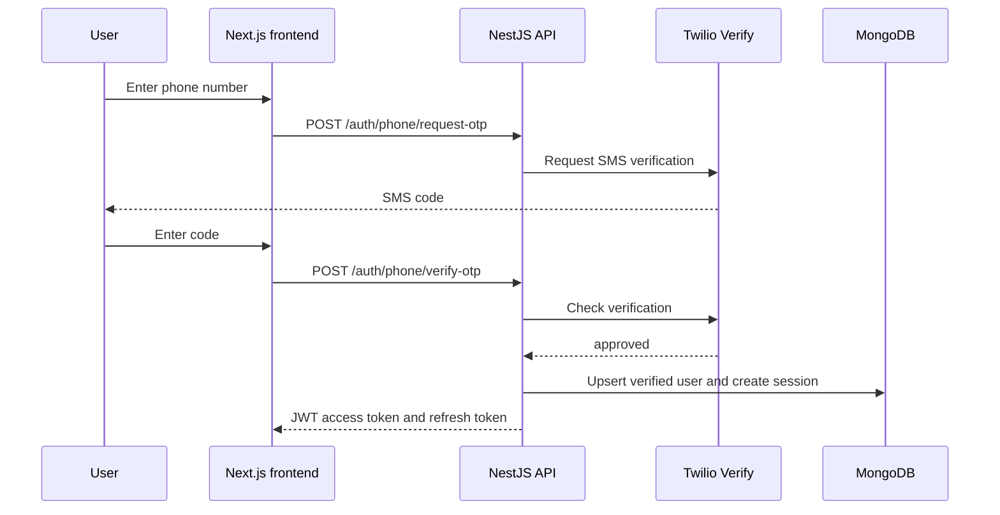

# Authentication

## SMS OTP Login

Twilio Verify is responsible for generating, expiring, throttling, and
checking one-time codes. The API stores the verified phone identity and its
own refresh sessions in MongoDB, but it never stores an OTP.
The Nest throttler limits SMS requests to three per minute and verification
submissions to five per minute per client by default.



All numbers must be sent in E.164 format, such as `+260971234567`.

### Request an OTP

```http
POST /api/v1/auth/phone/request-otp
Content-Type: application/json

{ "phoneNumber": "+260971234567" }
```

Success returns `202 Accepted`.

### Verify an OTP and Sign In

```http
POST /api/v1/auth/phone/verify-otp
Content-Type: application/json

{ "phoneNumber": "+260971234567", "code": "123456" }
```

Success returns `token`, `refreshToken`, `tokenExpires`, and `user`. A rejected
or expired code returns `401 Unauthorized`.

## Twilio Configuration

Create one Verify Service in Twilio and configure it in the active backend
environment file. For development this is `.env.development.local`; for
production use deployment secrets or `.env.production.local`:

```dotenv
TWILIO_ACCOUNT_SID=ACxxxxxxxxxxxxxxxxxxxxxxxxxxxxxxxx
TWILIO_AUTH_TOKEN=replace-with-your-twilio-auth-token
TWILIO_VERIFY_SERVICE_SID=VAxxxxxxxxxxxxxxxxxxxxxxxxxxxxxxxx
```

The current template deliberately sends only through the `sms` channel.
Twilio Verify also provides a path for a later WhatsApp channel without
changing the application's session model.

## Tokens and Sessions

An approved OTP results in the same application session contract as optional
email login:

- The short-lived access token authenticates `GET /api/v1/auth/me`.
- `POST /api/v1/auth/refresh` rotates refresh-token session hashes.
- `POST /api/v1/auth/logout` removes the refresh session.
- Access tokens remain valid until their configured expiry after logout.

Configure the token lifetimes and long random secrets through the `AUTH_*`
environment variables documented in `.env.development.example` and
`.env.production.example`.

---

Previous: [Database](database.md)

Next: [Serialization](serialization.md)
